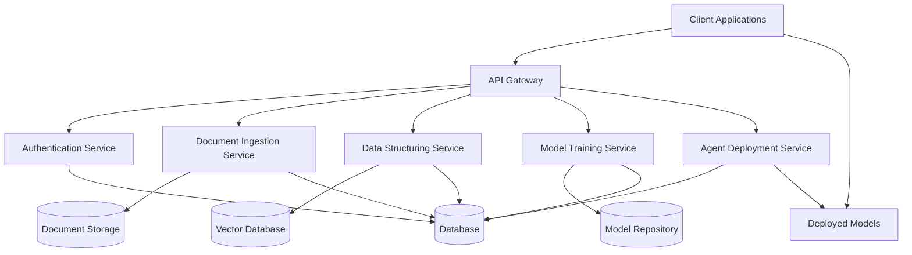

# LLM Training Platform Architecture

This document provides an overview of the LLM Training Platform architecture.

## System Architecture

The LLM Training Platform is built using a microservices architecture, with each service responsible for a specific part of the workflow. This design allows for better scalability, maintainability, and flexibility.

## Service Descriptions

### API Gateway

The API Gateway serves as the entry point for all client requests. It handles:

- Request routing to appropriate microservices
- Authentication and authorization
- Rate limiting
- Request/response logging
- API documentation

### Authentication Service

The Authentication Service manages user authentication and authorization:

- User registration and login
- Token generation and validation
- API key management
- Role-based access control

### Document Ingestion Service

The Document Ingestion Service handles the processing of various document formats:

- Document upload and validation
- Text extraction from PDFs, DOCX, and TXT files
- OCR for scanned documents with Arabic language support
- Document preprocessing (noise reduction, deskewing, etc.)
- Text normalization and cleaning

### Data Structuring Service

The Data Structuring Service organizes and structures the extracted text:

- Text chunking and segmentation
- Entity extraction
- Vector embedding generation
- Semantic indexing
- Metadata extraction and storage

### Model Training Service

The Model Training Service provides model training capabilities:

- Dataset preparation
- Model fine-tuning
- Training job management
- Model evaluation
- Model versioning

### Agent Deployment Service

The Agent Deployment Service handles the deployment of trained models:

- Model serving
- Retrieval-augmented generation (RAG) systems
- Query processing
- Response generation
- Usage monitoring

## Data Flow

1. **Document Upload**: Users upload documents through the API Gateway
2. **Document Processing**: The Document Ingestion Service processes the documents and extracts text
3. **Data Structuring**: The Data Structuring Service organizes and structures the extracted text
4. **Model Training**: The Model Training Service uses the structured data to fine-tune models
5. **Agent Deployment**: The Agent Deployment Service deploys the trained models as interactive agents
6. **Query Processing**: Users interact with the deployed agents through the API Gateway

## Security Architecture

The platform implements multiple layers of security:

- **Authentication**: JWT-based authentication for API access
- **Authorization**: Role-based access control for different platform features
- **API Keys**: API key management for programmatic access
- **Encryption**: Data encryption at rest and in transit
- **Isolation**: Complete on-premise deployment with no external dependencies

## Deployment Architecture

The platform can be deployed in various environments:

- **Docker**: Each service is containerized for easy deployment
- **Kubernetes**: For scalable, orchestrated deployments
- **On-Premise**: Fully deployable in isolated environments
- **Air-Gapped**: Can operate without internet connectivity

## Database Architecture

The platform uses multiple databases for different purposes:

- **Relational Database**: For structured data like user information, document metadata, etc.
- **Document Storage**: For storing original and processed documents
- **Vector Database**: For storing and querying vector embeddings
- **Model Repository**: For storing trained models and their versions
